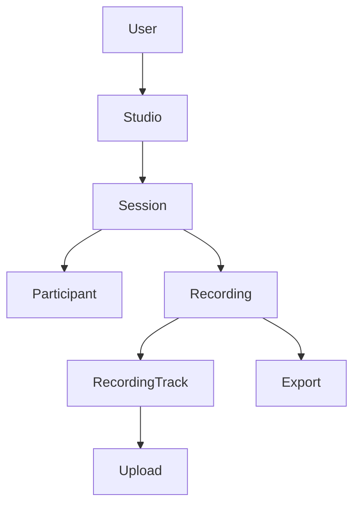

# V0.1 API Domain Model

## Status

Draft

## Purpose

This document defines the v0.1 API domain model for the Recording Core and lays out the planned PostgreSQL schema shape before any migrations are written.

It exists to prepare the next implementation steps:

- future database migrations
- future API endpoints
- future repository and storage-layer code

This is a planning document only. It does not create tables, routes, or runtime behavior.

## V0.1 Scope

The v0.1 model is intentionally small:

- 1 host
- 1 guest
- desktop-first
- private recordings by default
- separate raw tracks
- resumable upload
- final export

## Domain Model Overview

The API model centers on a single host-owned studio with sessions that invite a guest, capture local media, track upload progress, and produce a final export.

The core entities are:

- `User`
- `Studio`
- `Session`
- `Participant`
- `Recording`
- `RecordingTrack`
- `Upload`
- `Export`

## Entity Descriptions

### User

Purpose:

- represents the authenticated host account in v0.1

Ownership:

- owns studios
- owns sessions created inside those studios
- owns recordings and exports generated from those sessions

Important fields:

- `id`
- `email`
- `display_name`
- `password_hash` or external auth reference, depending on later auth work
- `created_at`
- `updated_at`

Relationships:

- one `User` owns many `Studio` records
- one `User` can create many `Session` records
- one `User` can own many `Recording` and `Export` records through the studio/session chain

v0.1 constraints:

- host account only
- guest does not need a user account
- authentication details remain intentionally minimal in this document

Out-of-scope for now:

- organization or team membership
- billing
- multiple host accounts per studio
- advanced auth flows such as MFA, SSO, or password reset

### Studio

Purpose:

- represents the host’s personal recording space
- groups sessions under one owner

Ownership:

- owned by one `User`

Important fields:

- `id`
- `owner_user_id`
- `name`
- `slug`
- `visibility`
- `created_at`
- `updated_at`

Relationships:

- one `Studio` belongs to one `User`
- one `Studio` contains many `Session` records

v0.1 constraints:

- one host owns the studio
- studio is private by default
- no shared studio members in v0.1

Out-of-scope for now:

- collaborative studio membership
- team roles
- public studio pages

### Session

Purpose:

- represents one recording event
- coordinates invitation, live presence, and the recording lifecycle

Ownership:

- belongs to one `Studio`
- is created and controlled by the host

Important fields:

- `id`
- `studio_id`
- `host_user_id`
- `invite_token_hash`
- `title`
- `status`
- `scheduled_at`
- `started_at`
- `ended_at`
- `created_at`
- `updated_at`

Relationships:

- one `Session` belongs to one `Studio`
- one `Session` has many `Participant` records
- one `Session` has one `Recording`

v0.1 constraints:

- one host and one guest only
- guest access is link-based
- session is private by default
- session state must remain easy to recover after refresh or interruption

Out-of-scope for now:

- multi-guest rooms
- open room discovery
- recurring sessions
- advanced scheduling and calendar integration

### Participant

Purpose:

- represents a person joined to a session
- records the host and guest presence independently from account state

Ownership:

- belongs to one `Session`
- host participant is associated with a `User`
- guest participant may exist without a `User`

Important fields:

- `id`
- `session_id`
- `user_id` nullable
- `role`
- `display_name`
- `join_token_hash`
- `status`
- `joined_at`
- `left_at`
- `created_at`
- `updated_at`

Relationships:

- one `Participant` belongs to one `Session`
- a `Participant` may optionally reference a `User`

v0.1 constraints:

- exactly one host participant
- at most one guest participant
- guest can join without an account

Out-of-scope for now:

- multiple guests
- participant permissions beyond host or guest
- rich participant profile data

### Recording

Purpose:

- represents the durable recording artifact for a session
- collects raw tracks and export results

Ownership:

- belongs to one `Session`

Important fields:

- `id`
- `session_id`
- `status`
- `started_at`
- `ended_at`
- `raw_media_ready_at`
- `export_ready_at`
- `created_at`
- `updated_at`

Relationships:

- one `Recording` belongs to one `Session`
- one `Recording` has many `RecordingTrack` records
- one `Recording` can have one `Export`

v0.1 constraints:

- one recording per session in v0.1
- raw source media must be preserved
- recording stays private by default

Out-of-scope for now:

- editing timelines
- transcript-driven derivatives
- multiple renders per session beyond the primary export

### RecordingTrack

Purpose:

- represents one raw participant media track
- keeps host and guest media separate for recovery and post-production flexibility

Ownership:

- belongs to one `Recording`
- may be associated with one `Participant`

Important fields:

- `id`
- `recording_id`
- `participant_id`
- `track_kind`
- `media_kind`
- `status`
- `storage_object_key`
- `content_type`
- `byte_size`
- `checksum`
- `duration_ms`
- `created_at`
- `updated_at`

Relationships:

- one `RecordingTrack` belongs to one `Recording`
- one `RecordingTrack` usually maps to one participant and one media kind
- one `RecordingTrack` has one `Upload`

v0.1 constraints:

- keep raw host and guest media separate
- support separate audio and video tracks
- exactly four logical track types are expected in v0.1:
  - host audio
  - host video
  - guest audio
  - guest video

Out-of-scope for now:

- derived composite tracks
- automated multi-camera track mapping
- server-side track editing

### Upload

Purpose:

- tracks resumable upload progress for one recording track
- records the state required for recovery after interruption

Ownership:

- belongs to one `RecordingTrack`

Important fields:

- `id`
- `recording_track_id`
- `protocol`
- `status`
- `upload_session_id`
- `expected_byte_size`
- `received_byte_size`
- `chunk_size`
- `checksum`
- `last_error`
- `started_at`
- `completed_at`
- `created_at`
- `updated_at`

Relationships:

- one `Upload` belongs to one `RecordingTrack`
- an `Upload` reflects chunked resumable progress for that track

v0.1 constraints:

- resumable upload is required
- upload completion must be explicit
- upload state must survive temporary disconnects and refreshes

Out-of-scope for now:

- public download URLs
- advanced multipart transfer controls
- cross-track upload batching

### Export

Purpose:

- represents the final rendered deliverable for a recording

Ownership:

- belongs to one `Recording`

Important fields:

- `id`
- `recording_id`
- `status`
- `format`
- `width`
- `height`
- `storage_object_key`
- `byte_size`
- `duration_ms`
- `created_at`
- `completed_at`
- `updated_at`

Relationships:

- one `Export` belongs to one `Recording`
- one `Recording` can produce one primary export in v0.1

v0.1 constraints:

- final export is 1080p, 16:9, YouTube-ready
- export is private by default
- export should remain tied back to the source recording

Out-of-scope for now:

- multiple export presets
- vertical or social-specific render variants
- share pages or public playback

## Planned Database Tables

The schema plan mirrors the core domain entities:

- `users`
- `studios`
- `sessions`
- `participants`
- `recordings`
- `recording_tracks`
- `uploads`
- `exports`

### users

Planned columns:

- `id`
- `email`
- `display_name`
- `password_hash` or auth provider reference
- `created_at`
- `updated_at`

### studios

Planned columns:

- `id`
- `owner_user_id`
- `name`
- `slug`
- `visibility`
- `created_at`
- `updated_at`

### sessions

Planned columns:

- `id`
- `studio_id`
- `host_user_id`
- `invite_token_hash`
- `title`
- `status`
- `scheduled_at`
- `started_at`
- `ended_at`
- `created_at`
- `updated_at`

### participants

Planned columns:

- `id`
- `session_id`
- `user_id` nullable
- `role`
- `display_name`
- `join_token_hash`
- `status`
- `joined_at`
- `left_at`
- `created_at`
- `updated_at`

### recordings

Planned columns:

- `id`
- `session_id`
- `status`
- `started_at`
- `ended_at`
- `raw_media_ready_at`
- `export_ready_at`
- `created_at`
- `updated_at`

### recording_tracks

Planned columns:

- `id`
- `recording_id`
- `participant_id`
- `track_kind`
- `media_kind`
- `status`
- `storage_object_key`
- `content_type`
- `byte_size`
- `checksum`
- `duration_ms`
- `created_at`
- `updated_at`

### uploads

Planned columns:

- `id`
- `recording_track_id`
- `protocol`
- `status`
- `upload_session_id`
- `expected_byte_size`
- `received_byte_size`
- `chunk_size`
- `checksum`
- `last_error`
- `started_at`
- `completed_at`
- `created_at`
- `updated_at`

### exports

Planned columns:

- `id`
- `recording_id`
- `status`
- `format`
- `width`
- `height`
- `storage_object_key`
- `byte_size`
- `duration_ms`
- `created_at`
- `completed_at`
- `updated_at`

## Relationship Overview

The planned shape is:

In plain terms:

- `User -> Studio -> Session -> Recording -> RecordingTrack`
- `Session -> Participant`
- `RecordingTrack -> Upload`
- `Recording -> Export`

## Status Lifecycle

### Session

Planned statuses:

- `draft`
- `waiting`
- `live`
- `ended`
- `cancelled`

### Participant

Planned statuses:

- `invited`
- `joined`
- `left`

### Recording

Planned statuses:

- `pending`
- `recording`
- `uploaded`
- `processing`
- `ready`
- `failed`

### RecordingTrack

Planned statuses:

- `pending`
- `uploading`
- `uploaded`
- `processing`
- `ready`
- `failed`

### Upload

Planned statuses:

- `pending`
- `uploading`
- `paused`
- `completed`
- `failed`

### Export

Planned statuses:

- `pending`
- `processing`
- `ready`
- `failed`

## Privacy and Access Assumptions

- recordings are private by default
- the host owns the studio, session, recordings, and export chain
- guest access is link-based for v0.1
- raw tracks are not publicly accessible by default
- final exports are not publicly accessible by default
- signed or temporary download URLs can be introduced later

## Future Tasks Unlocked

This document prepares the implementation path for:

- DS-022 migration foundation
- DS-023 initial schema migrations
- DS-024 API repository/storage layer
- DS-025 initial session API

